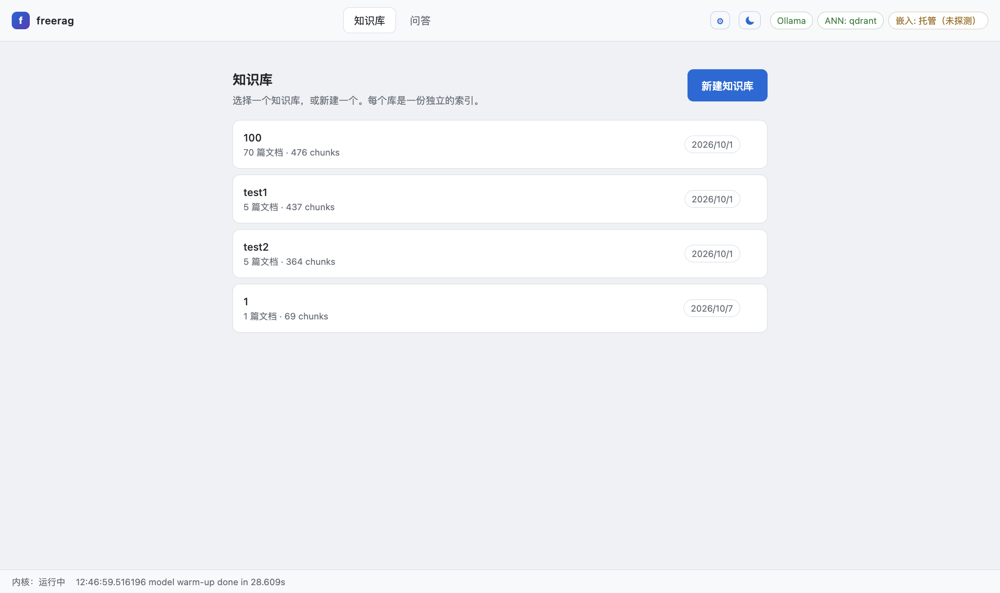
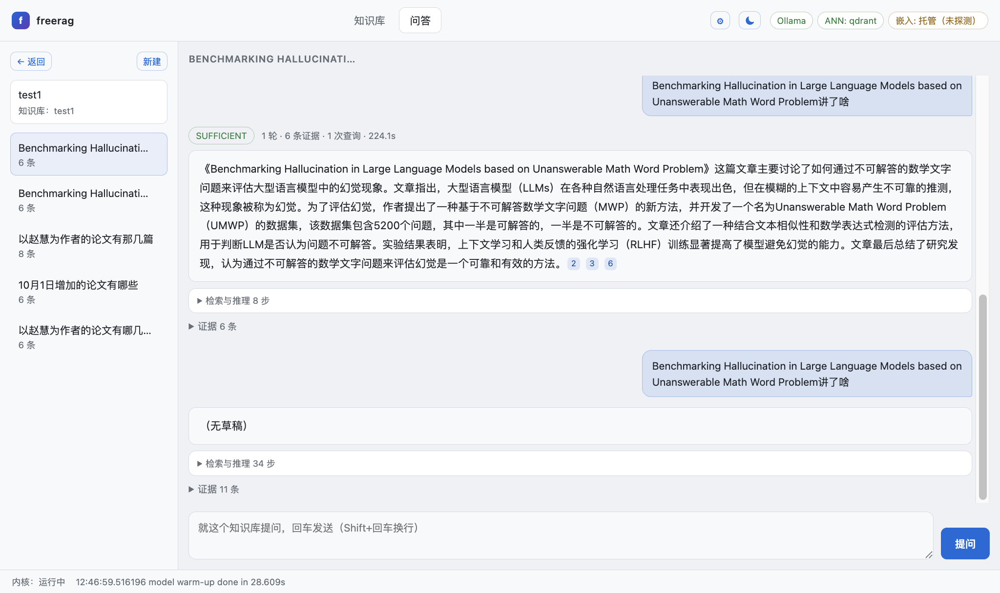
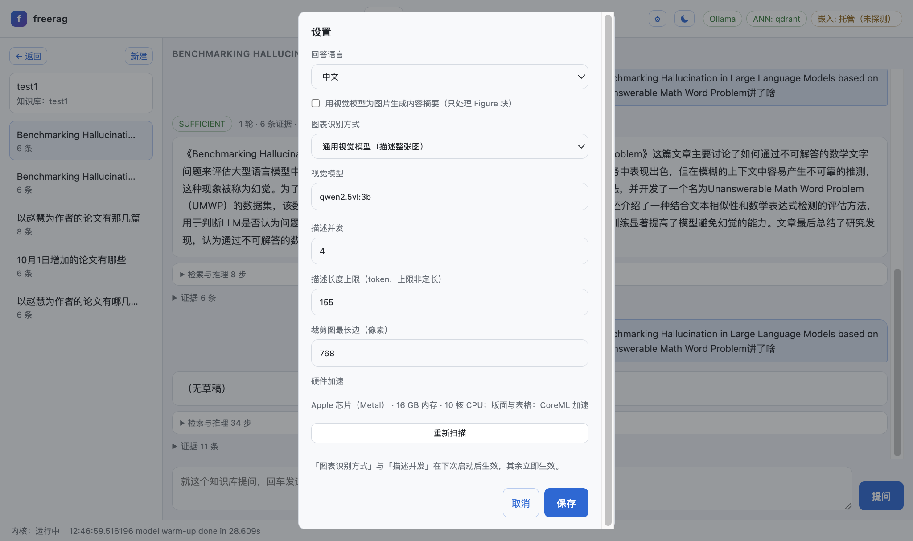

# FreeRAG

A local-first desktop Agentic RAG system: every model runs on your machine, and your data lives in a single JSON file.

> **中文优先** — see [README.zh-CN.md](README.zh-CN.md). Design notes: [docs/plan.md](docs/plan.md).

[](https://github.com/Caobaining1/FreeRAG/releases/latest)

## Download

Prebuilt installers (Linux AppImage, macOS dmg) are published as [GitHub Releases](https://github.com/Caobaining1/FreeRAG/releases/latest). Download, open, and the app fetches nothing else — Ollama and the model set ship inside (Route A). Windows packaging is not yet self-contained; build it from source with [scripts/build-installer.sh](scripts/build-installer.sh).

## Screenshots








## Architecture

| Layer | Built with | Role |
| :--- | :--- | :--- |
| Desktop | Electron | shell, hardware scan, spawns the kernel |
| Kernel | Go | orchestration, indexing, retrieval |
| Parsing | Python sidecar | PDF → layout → chunks (PyMuPDF + ONNX) |
| Inference | Ollama / llama.cpp | generation, routing, sufficiency |
| Retrieval | Qdrant + BM25 | dense ANN and keyword, fused with RRF |
| Storage | one JSON file | chunk index, no external database |

## Quick start

```bash
scripts/install-go.sh                       # toolchain, into .toolchain/go
python3 -m venv .venv314
.venv314/bin/python -m pip install -r requirements.txt
scripts/download-models.sh                  # local models, ~4.4 GB

export PATH="$PWD/.toolchain/go/bin:$PATH"
export GOPROXY=https://goproxy.cn,direct    # eino needs a mirror
go build -o bin/freerag ./cmd/freerag

cd desktop && npm install && npm start
```

Installers: `scripts/build-installer.sh` (macOS dmg / Windows exe / Linux AppImage).

## What works, measured

| Feature | Measured |
| :--- | :--- |
| Hybrid retrieval | BM25 (CJK bigrams) + dense ANN, fused with RRF |
| Dense ANN (Qdrant) | recall@10 = 1.000; falls back to exact scan with a loud warning |
| Incremental indexing | keyed by content MD5: 21.5 s → 0.18 s on a re-parse |
| Table recovery (TSR) | real paper tables to Markdown, 1/10 → 9/10 |
| Agentic answering | Laya picks the next tool call each round (~100 ms) |
| REFRAG compression | off by default; controlled A/B shows TTFT 4.01× (25.8 s → 6.4 s) |

## Acceleration across platforms

The app scans the machine once at first launch (accelerator, cores, memory) and caches it in `userData/hardware.json`.

ONNX Runtime is installed per platform: the DirectML build on Windows, the CoreML-carrying official wheel elsewhere; CUDA is opt-in (`ORT_FLAVOUR=cuda`, ~2 GB of wheels).

The chart model needs ≥ 12 GB of memory. A model that does not fit does not fail — it swaps and takes the machine with it — so it is refused before the process starts.

## Docs

- Design: [docs/plan.md](docs/plan.md)
- Performance: [docs/performance.md](docs/performance.md)
- Acceptance: `scripts/acceptance.sh` (build / unit tests / Python tests / a real PDF / error codes across the process boundary)


